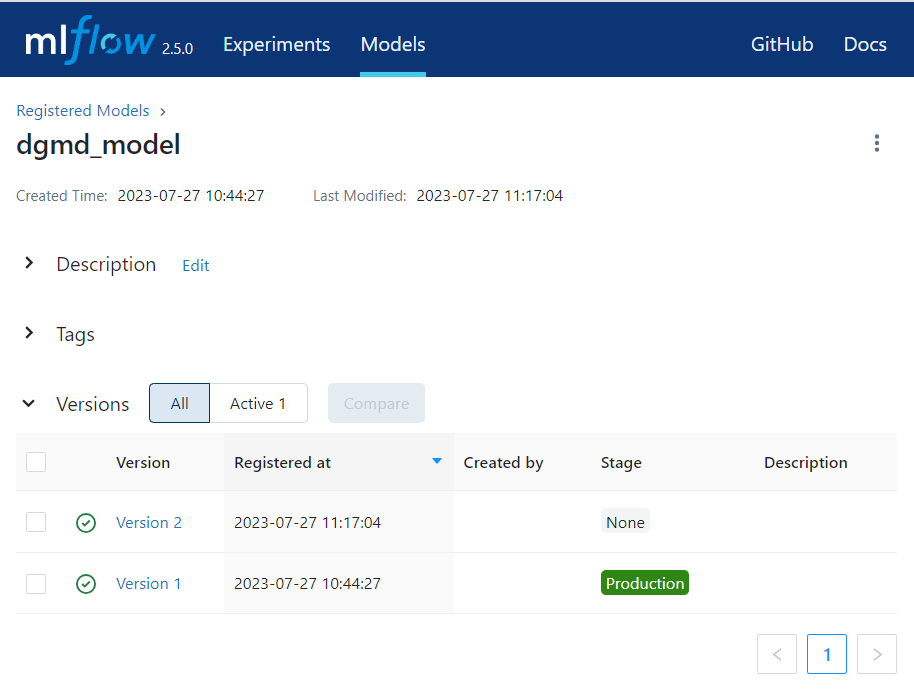

# mlflow

This repository provides configuration for the [Mlflow](https://mlflow.org/docs/latest/index.html) docker container used as part of our deployed Machine-Learning API infrastructure.

DGMD MLflow image is automatically built (via GitHub Action) and [deployed to GitHub Container Registry](https://github.com/orgs/hssrobotics23/packages?repo_name=mlflow) on any code changes to main branch.

MLflow provides core infrastructure capability including:

* Records accuracy metrics for each training model run
* Stores model artifacts that can be accessed from other infrastructure components
* Enables management of model versions from Staging to Production to enable model release management

## Static Configuration:

This docker image is configured to:
* Use S3 `s3://dgmd-mlflow-store` as model artifact backend
* Use local sqlite database (\db) for application data 

## Recommended Environmental Variables & configurations

As image uses boto3 for S3 read/write access it requires AWS credentials.  It is recommended that an aws_credentials file is provided by binding a volume to /secrets directory in image and setting environment variable `AWS_SHARED_CREDENTIALS_FILE` to `/secrets/aws_credentials`

An example of mlflow container configuration can be found in DGMD [app-deployment docker-composer.yml](https://github.com/hssrobotics23/app-deployment/blob/main/docker-compose.yml):

```
  mlflow:
    restart: always
    image: ghcr.io/hssrobotics23/mlflow/dgmd_mlflow:latest
    container_name: dgmd_mlflow
    environment:
      - AWS_SHARED_CREDENTIALS_FILE=/secrets/aws_credentials
    volumes:
      - db-vol:/db
      - secret-vol:/secrets
    ports:
      - "5000:5000"
    expose:
      - "5000"
```

## Example Screenshot

